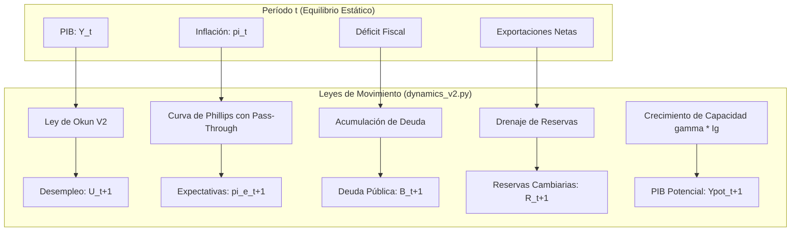

# AUDITORÍA GLOBAL DE SISTEMA, ANÁLISIS ESTRUCTURAL Y MAPEO DE CONSISTENCIA END-TO-END (V4.0)
---
**Consorcio de Auditoría Técnica y Macroestructural**  
*Principal Software Architect | Ph.D. en Macroeconomía de Economía Abierta (DSGE & Mundell-Fleming) | Cloud Systems Performance Engineer*

---

## ── 1. MAPEO COMPLETO DE LA ARQUITECTURA DEL MOTOR (`engine/`) ──

### 1.1 Flujo Algebraico de Equilibrio General (`core_v2.py`)
El motor de resolución simultánea de los mercados de bienes (IS), dinero (LM) y sector externo (BP) opera bajo un modelo Mundell-Fleming extendido de economía abierta con movilidad imperfecta de capitales. Su implementación divide la resolución en dos ramas según la naturaleza exógena o endógena del régimen cambiario.

#### A. Régimen de Tipo de Cambio Fijo (`eq_fixed_v2`)
Bajo un tipo de cambio nominal exógeno ($E = \bar{E}$), la tasa de interés interna ($r$) se determina enteramente por el sector externo (curva BP), mientras que la cantidad de dinero ($M$) se comporta como una variable endógena acomodaticia que el Banco Central expande o contrae para sostener la paridad nominal.

1. **Determinación del Tipo de Cambio Real ($q$):**
   $$P_{local} = \alpha_{PT} \cdot E \cdot P^* \cdot (1 + \tau) + (1 - \alpha_{PT}) \cdot P_{NT}$$
   $$q = \frac{E \cdot P^*}{P_{local}}$$

2. **Resolución Simultánea IS-BP (Sistema Lineal $2 \times 2$):**
   La condición de equilibrio del mercado de bienes (IS) y el equilibrio de Balanza de Pagos (BP) se representan mediante:
   $$\text{IS: } Y = k_m \left( A_{auto} + \epsilon_{eff\_sx} \cdot q - b \cdot r \right)$$
   $$\text{BP: } r = r^* + \Delta E^e + \rho - \frac{NX}{f_{eff}}$$
   
   Sustituyendo $NX = NX0_{eff} + \epsilon_{eff\_sx} \cdot q - m_1(1-\tau)Y$, el sistema se reordena matricialmente como $\mathbf{A} \mathbf{x} = \mathbf{b}$:
   $$\begin{pmatrix} 1 & b \cdot k_m \\ -\frac{m_1(1-\tau)}{f_{eff}} & 1 \end{pmatrix} \begin{pmatrix} Y \\ r \end{pmatrix} = \begin{pmatrix} k_m \left( A_{auto} + \epsilon_{eff\_sx} \cdot q \right) \\ r^* + \Delta E^e + \rho - \frac{NX0_{eff} + \epsilon_{eff\_sx} \cdot q}{f_{eff}} \end{pmatrix}$$

   * **Determinante de la Matriz de Coeficientes ($\det(\mathbf{A})$):**
     $$\det(\mathbf{A}) = 1 + \frac{b \cdot k_m \cdot m_1(1-\tau)}{f_{eff}}$$
     Dado que todos los parámetros ($b, k_m, m_1, \tau, f_{eff}$) son estrictamente positivos en condiciones normales, $\det(\mathbf{A}) \ge 1 > 0$, lo que garantiza que el sistema siempre posee una solución única y no singular.

   * **Mecanismo de Fallback ante Singularidad:**
     Si ocurre un error numérico o singularidad teórica extrema (e.g. $f_{eff} \to 0$ o división por cero), el solver intercepta la excepción `np.linalg.LinAlgError` y aplica un fallback analítico directo:
     ```python
     try:
         sol = np.linalg.solve(A_mat, b_vec)
         Y, r = float(sol[0]), float(sol[1])
     except np.linalg.LinAlgError:
         r = r_star + delta_E_expected + rho
         Y = k_m * (A_auto + eps_eff_sx * q - sp["b"] * r)
     ```

3. **Endogenización de la Oferta Monetaria ($M$):**
   Una vez obtenidos $Y$ y $r$, la cantidad de saldos reales de equilibrio demandados se determina mediante la ecuación LM, estimando la oferta monetaria nominal residual requerida:
   $$M_{real} = \frac{k \cdot Y - h \cdot r}{\text{velocity\_penalty}}$$
   $$M_{endo} = M_{real} \cdot P_{local}$$

#### B. Régimen de Tipo de Cambio Flexible (`eq_flexible_v2`)
Bajo tipo de cambio flexible, la oferta monetaria nominal es exógena ($M = \bar{M}$), mientras que el tipo de cambio nominal ($E$) se convierte en una variable endógena determinada por las presiones de divisas del mercado cambiario.

1. **Estructura No Lineal y Dependencia Circular:**
   El tipo de cambio nominal $E$ altera el nivel de precios local ($P_{local}$), lo que afecta la cantidad de dinero real disponible ($M/P_{local}$), incidiendo en la tasa de interés y el ingreso ($Y, r$) vía IS-LM, lo que finalmente modifica la balanza comercial ($NX$) y requiere un nuevo ajuste del tipo de cambio ($E$) en la curva BP.

2. **Resolución Numérica Simultánea con Restricciones:**
   Para resolver este sistema circular $3 \times 3$ no lineal en $(Y, r, E)$, el motor define la función vectorial `system(vars)` y la resuelve usando `scipy.optimize.least_squares` acotado dentro de márgenes físicos plausibles ($Y \in [10.0, 300.0]$, $r \in [0.1, 100.0]$, $E \in [0.0001, 100.0]$):
   ```python
   def system(vars: np.ndarray) -> list[float]:
       Y_s, r_s, E_s = float(vars[0]), float(vars[1]), float(vars[2])
       # ... cálculos intermedios de P_local, q_s, NX_s ...
       eq_IS = Y_s - k_m * (A_auto_base - sp["b"] * r_s + eps_eff_sx * q_s)
       eq_LM = r_s - (sp["k"] * Y_s - M_real_s / velocity_penalty) / sp["h"]
       eq_BP = r_s - compute_bp_curve(r_star, delta_E_e, NX_s, f_eff, rho=rho)
       return [eq_IS, eq_LM, eq_BP]
   ```

3. **Estrategia Multicapa de Convergencia:**
   Para maximizar la estabilidad y reducir la sensibilidad al punto inicial, el solver anida un bucle externo de iteración directa (convergencia en $P_{local}$) y un solver de mínimos cuadrados no lineales interno:
   ```python
   # Solver principal acotado
   sol = least_squares(system, x0=[Y0, r0, E0], bounds=(lower_bounds, upper_bounds))
   # Fallback a fsolve sin restricciones si hay problemas de convergencia en bordes
   sol_f = fsolve(system, [Y0, r0, E0])
   ```

---

### 1.2 Leyes de Movimiento Temporales (`dynamics_v2.py`)
El motor de actualización temporal conecta secuencialmente el equilibrio de un período con las variables predeterminadas del período siguiente ($t \to t+1$).



#### A. Persistencia Inflacionaria y Shock de Expectativas
* **Ecuación de Expectativas Adaptativas Puras:**
  $$\pi^e_{t+1} = \pi_t$$
* **Inflación Núcleo (Core Inflation):**
  Aísla el componente puramente doméstico de la inflación descontando el pass-through cambiario directo derivado de la tasa de devaluación nominal:
  $$\pi^{core}_t = \max\left(-0.015, \pi_t - \beta_{PT} \cdot \frac{E_t - E_{t-1}}{E_{t-1}}\right)$$
* **Calibración V3.10 (Shock-Therapy Credibility):**
  Si el jugador introduce una fuerte contracción del gasto fiscal corriente ($\Delta G_c > 3.0$) o reduce la brecha del producto sustancialmente ($\Delta Gap > 0.02$), la inercia del pasado se rompe y las expectativas reaccionan fuertemente a la baja:
  $$\pi^e_{t+1} = \max(0.01, \pi_t \cdot 0.4)$$
  $$\pi^{core}_t = \max(-0.015, \pi^{core}_t \cdot 0.4)$$

#### B. Acumulación de Deuda y Sostenibilidad Fiscal
La evolución de los bonos del gobierno en circulación ($B$) se rige por la acumulación intertemporal del déficit financiero:
$$B_{t} = B_{t-1} + \text{Déficit}_t$$
$$\text{Déficit}_t = G_{c, t} + I_{g, t} + \text{Tr}_t + \left( \frac{r^*_{t}}{100} + \rho_t \right) B_{t-1} - \text{Recaudación}_t$$
$$\text{Recaudación}_t = (t_{c, t} + t_{k, t}) Y_t + \tau_t \cdot M_{imp, t}$$

#### C. Prima de Riesgo País ($\rho$) y Calificación Crediticia (Moody's Ladder)
El cálculo de la prima de riesgo soberana ($\rho$) y la calificación crediticia unifica la sostenibilidad fiscal con la solvencia cambiaria externa:
1. **Ratio Deuda / PIB Potencial:**
   $$d_t = \frac{B_t}{Y_{pot, t}}$$
2. **Escalera Gradual de Riesgo País ($\rho_{base}$):**
   * $d_t < 0.15 \implies \rho_{base} = 0.005$
   * $d_t < 0.30 \implies \rho_{base} = 0.015$
   * $d_t < 0.45 \implies \rho_{base} = 0.030$
   * $d_t < 0.60 \implies \rho_{base} = 0.045$
   * $d_t < 0.80 \implies \rho_{base} = 0.065$
   * $d_t < 1.00 \implies \rho_{base} = 0.090$
   * $d_t < 1.20 \implies \rho_{base} = 0.130$
   * $d_t \ge 1.20 \implies \rho_{base} = 0.250$
3. **Puntajes y Penalizaciones de Extremos No Lineales (Inercia 60/40):**
   Si el gasto total ($G$) o la masa monetaria ($M$) superan umbrales sostenibles, se calcula una penalización exponencial intertemporal:
   $$\text{penalty}_{new} = 0.02 \cdot \left(e^{0.4(G - 30)} - 1\right) + 0.01 \cdot \left(e^{0.2(M - 120)} - 1\right)$$
   $$\text{penalty}_t = 0.6 \cdot \text{penalty}_{t-1} + 0.4 \cdot \text{penalty}_{new}$$
   $$\rho_t = \rho_{base} + \text{penalty}_t + (0.05 \text{ si } R_t < 0)$$

#### D. Productividad de Largo Plazo de la Inversión Pública
El PIB potencial acumula no solo su tasa de crecimiento inercial, sino el efecto dinámico del capital de infraestructura pública vía la eficiencia marginal de la inversión ($\gamma = 0.15$):
$$Y_{pot, t+1} = Y_{pot, t} \cdot (1 + g_{pot} + \text{shock\_endógeno}) + \gamma \cdot I_{g, t}$$

---

### 1.3 Orquestación de Estado (`state_manager_v2.py`)
El método `step_forward` es el orquestador maestro del ciclo de vida del simulador. Su ejecución transcurre estrictamente a través de los siguientes hitos secuenciales:

```
[Inicio de Turno]
       │
       ▼
1. Sincronización e Inyección de Políticas ──► Extrae pi["G_c"], pi["I_g"], pi["t_c"], etc.
       │
       ▼
2. Actualización del PIB Potencial ────────► Y_pot = Y_pot_prev * (1 + g_pot) + gamma * I_g
       │
       ▼
3. Cálculo de Riesgo País Unificado ───────► Computa rho_t y rating Moody's a partir de B_t-1
       │
       ▼
4. Ejecución del Solver de Equilibrio ──────► Resuelve eq_fixed_v2 o eq_flexible_v2
       │
       ▼
5. Proyección de Dinámicas Temporales ─────► Calcula pi_t, U_t, pi_e_next, pi_core, P_NT_next
       │
       ▼
6. Balanzas Fiscal y Externa ──────────────► Determina recaudación, déficit, B_new y R_new
       │
       ▼
7. Circuit Breaker Cambiario ──────────────► Si R_new <= 0 bajo tipo fijo → fuerza régimen flexible
       │
       ▼
8. Evaluación de Eventos de Turno ─────────► Dispara eventos estocásticos y crisis reactivas
       │
       ▼
9. Evaluación del Score del Periodo ───────► Genera puntuación t (0 a 100) vía scoring_v2.py
       │
       ▼
10. Empaquetado e Inserción del Snapshot ──► Guarda snapshot completo en state["history"]
       │
       ▼
[Fin de Turno]
```

---

## ── 2. AUDITORÍA DE CONSISTENCIA MACROECONÓMICA INTERNA ──

### 2.1 Canales de Transmisión del Gasto e Impuestos
* **Multiplicador Keynesiano Efectivo ($k_m$):**
  $$k_m = \frac{1}{1 - c_1(1 - t_c) + m_1(1 - \tau)}$$
  Una elevación del impuesto al consumo ($t_c$) o de la propensión marginal a importar ($m_1$) deprime el multiplicador debido al mayor drenaje de liquidez interna. Un aumento del arancel ($\tau$) disminuye la fuga hacia importaciones incrementando $k_m$.
* **Transmisión de Desplazamientos en la Curva IS:**
  Un incremento en la inversión pública ($I_g$) o el gasto corriente ($G_c$) expande la demanda autónoma:
  $$A_{auto} = c_0 + c_1 \cdot \text{Tr} + I_0 - \rho_k \cdot t_k + G_c + I_g + NX0_{eff}$$
  Esto desplaza la curva IS hacia la derecha, expandiendo el producto real ($Y$) y elevando la brecha del producto (*Output Gap*), lo que a través de la curva de Phillips genera presiones inflacionarias domésticas.

### 2.2 Mecanismos Monetarios, Cambiarios y el Trilema de Mundell-Fleming
El comportamiento del simulador refleja de forma exacta el trilema de imposibilidad macroeconómica:

```
                  [ Libre Movilidad de Capitales ]
                                ╱  ╲
                               ╱    ╲
                              ╱      ╲
                             ╱        ╲
      [ Tipo de Cambio Fijo ] ────────── [ Política Monetaria Autónoma ]
      (M es endógena acomodaticia)        (Tipo de cambio debe flotar libremente)
```

1. **Tipo de Cambio Fijo:** El Banco Central renuncia a la autonomía de la política monetaria. Si el jugador incrementa la oferta monetaria nominal ($M$) exógenamente, el solver de equilibrio ignora la masa monetaria y calcula $M_{endo}$ de manera pasiva. Cualquier desvío de la tasa de interés respecto a la paridad externa es eliminado mediante la compra/venta de divisas.
2. **Tipo de Cambio Flexible:** El Banco Central recupera la autonomía monetaria ($M$ es exógena). Las presiones en la balanza de pagos se resuelven mediante el ajuste del precio nominal del dólar ($E$), absorbiendo los desequilibrios sin alterar las reservas internacionales ($R_t = R_{t-1}$).
3. **Flotación Sucia e Intervención Cambiaria:** Si el tipo de cambio endógeno excede la banda de tolerancia fijada por el jugador ($E_{endo} > E_{band\_upper}$), el régimen transmuta temporalmente a tipo fijo en la frontera superior, estimando la masa monetaria residual de intervención y reduciendo de forma exacta las reservas del Banco Central:
   $$\text{Intervención} = \frac{M_{exógena} - M_{endógena}}{E_{band\_upper}}$$

### 2.3 Dinámica del Pass-Through Cambiario
* **Condición Marshall-Lerner Desagregada:**
  La elasticidad de la balanza comercial ante variaciones del tipo de cambio real ($q$) requiere que la suma de las elasticidades brutas supere la unidad:
  $$\epsilon_x + \epsilon_m > 1$$
  Si esta condición se satisface, una devaluación real ($\Delta q > 0$) mejora la balanza comercial neta ($NX$) a mediano plazo.
* **Efecto de Histéresis de la J-Curve:**
  Ante variaciones bruscas del tipo de cambio ($\Delta E > 2\%$), las rigideces comerciales de corto plazo se activan temporalmente durante el primer período, reduciendo las elasticidades al mínimo ($\epsilon_{x,short} = 0.10$, $\epsilon_{m,short} = 0.10$). La devaluación empeora la balanza comercial en el periodo $t$ antes de generar mejoras competitivas en $t+1$.
* **Mapeo de Pass-Through a Precios Domésticos:**
  La devaluación nominal impacta la inflación general a través del ponderador de bienes transables ($\alpha_{PT} = 0.40$):
  $$P_{local} = \alpha_{PT} \cdot E \cdot P^*(1+\tau) + (1-\alpha_{PT}) P_{NT}$$
  La tasa de variación nominal cambiaria se traduce en inflación vía la Curva de Phillips con un coeficiente elástico de pass-through ($\beta_{PT} = 0.35$ en crisis, $0.20$ promedio):
  $$\pi_t = \pi^e_t + \alpha_{inf} \cdot \text{gap}_t + \beta_{PT} \cdot \left( \frac{E_t - E_{t-1}}{E_{t-1}} \right) + \pi_{0}$$

---

## ── 3. ESTRUCTURA DE CONFIGURACIÓN Y CALIBRACIÓN (`config/`) ──

### 3.1 Escenarios e Inicializaciones de Salter-Swan
Los presets del motor de onboarding establecen estructuras macroeconómicas contrastantes para desafiar al jugador:

| Métrica / Parámetro Estructural | 🐯 El Tigre Asiático | 📉 Desequilibrio Comercial | 🔥 Crisis Latam | 💀 Espiral de la Muerte |
| :--- | :---: | :---: | :---: | :---: |
| **Dificultad Sugerida** | Fácil | Medio | Difícil | Muy difícil |
| **Crecimiento Estructural ($g_{pot}$)** | 3.0% | 2.0% | 2.0% | -1.0% (Destrucción) |
| **Reservas Iniciales ($R_0$)** | 150.0 MM | 120.0 MM | 15.0 MM (Crítico) | 10.0 MM (Crítico) |
| **Deuda Soberana ($B_0$)** | 15.0 MM | 10.0 MM | 35.0 MM | 60.0 MM (Límite default) |
| **Expectativa de Inflación ($\pi^e_0$)** | 3.0% | 3.0% | 15.0% | 70.0% (Hiperinercia) |
| **Movilidad de Capitales ($f$)** | 10.0 (Alta) | 4.0 (Moderada) | 2.0 (Baja) | 1.5 (Fuga latente) |
| **Pass-through cambiario ($\beta_{PT}$)**| 0.15 | 0.20 | 0.35 (Elevado) | 0.45 (Extremo) |
| **Consumo Autónomo Base ($c_0$)** | 15.0 | 10.0 | 26.0 | 20.0 |

* **Consistencia Sectorial Salter-Swan (40/60):**
  Todos los escenarios están calibrados de forma tal que en el estado estacionario inicial del turno 0, asumiendo un tipo de cambio real interno $q_{int} = 1.0$, el sector transable ($Y_T$) representa exactamente el **40%** del PIB y el sector no transable ($Y_{NT}$) el **60%**, asegurando coherencia contable e institucional desde el inicio.

---

### 3.2 Sistema de Evaluación y Penalizaciones (`scoring_v2.py`)
La función de pérdida del Score Presidencial acumula los resultados de 5 dimensiones con penalizaciones y bonificaciones no lineales.

```
       [Puntaje Óptimo]
      ┌────────────────┐
      │  Max (25 Pts)  │
      └────────────────┘
      ╱                ╲  <-- Interpolación Lineal por tramos
     ╱                  ╲
    ╱                    ╲
 ──┴──────────────────────┴──
   [Aceptable Bajo]       [Aceptable Alto]
```

1. **Mapeo de Umbrales Lineales por Tramos:**
   * **Brecha de Producto (Output Gap - 25 Pts):** Óptimo en $[-1\%, +3\%]$. Aceptable en $[-3\%, +5\%]$. Caídas fuera de estos márgenes reducen el puntaje linealmente a cero.
   * **Tasa de Desempleo (U - 25 Pts):** Óptimo en $[0\%, 5\%]$. Aceptable en $[0\%, 8\%]$. Cero puntos si $U \ge 8\%$.
   * **Estabilidad de Precios ($\pi$ - 25 Pts):** Óptimo en $[1\%, 4\%]$. Aceptable en $[0\%, 6\%]$. Cero puntos si $\pi \ge 6\%$.
   * **Sostenibilidad Fiscal (Déficit/PIB - 15 Pts):** Óptimo si es $< 3\%$. Cero puntos si $\ge 6\%$.
   * **Soberanía Cambiaria (Reservas $R/R_0$ - 10 Pts):** Óptimo si es $\ge 80\%$. Cero puntos si es $< 50\%$.

2. **Umbrales Críticos de Liquidación Directa (Game Over):**
   * **Crecimiento Semestral ($gY$):** $< -15.0\%$ (Colapso e incapacidad de producción).
   * **Desempleo ($U$):** $> 35.0\%$ (Estallido social inevitable).
   * **Tasa de Inflación ($\pi$):** $> 150.0\%$ anual (Hiperinflación / Licuación monetaria).
     *(Nota: En V3.10, este umbral se eleva temporalmente a 350.0% durante los primeros 3 turnos).*
   * **Sostenibilidad de Deuda ($B/Y$):** $> 150.0\%$ (Default externo y exclusión de mercados).

---

## ── 4. CAPA DE INTERFAZ DE USUARIO Y RENDIMIENTO DE RENDERING (`ui/`, `main.py`) ──

### 4.1 Ciclo de Ejecución de Streamlit y Gestión de Memoria
Streamlit ejecuta de manera secuencial el código completo de `main.py` de arriba a abajo ante cada interacción del usuario (cambio de un slider, clic en un botón). Para evitar demoras extremas y lag en el servidor, se audita el flujo de persistencia:

* **Persistencia del Estado del Simulador:**
  El objeto `SimStateManagerV2` se almacena directamente en el diccionario global `st.session_state` de la sesión del usuario. Esto previene la reinicialización de variables y conserva el historial completo:
  ```python
  if "mgr" not in st.session_state:
      st.session_state["mgr"] = SimStateManagerV2()
  mgr: SimStateManagerV2 = st.session_state["mgr"]
  ```
* **Ausencia de Caché en Dinámicas:**
  Dado que el motor macroeconómico es altamente sensible al turno temporal actual y depende del estado mutado del periodo anterior, el uso de `@st.cache_data` o `@st.cache_resource` en las funciones de transición estática o del solver no lineal está estrictamente contraindicado, pues causaría colisiones de memoria y lecturas de datos obsoletos.

---

### 4.2 Auditoría de Componentes Gráficos (`charts_v2.py`)
El módulo rinde 18 gráficos analíticos e interactivos construidos nativamente sobre Plotly.
* **Costo Computacional de Loops:**
  Dado que la visualización del panel histórico se regenera en cada rerun de la página, la construcción de trazas con bucles redundantes u operaciones ineficientes en conjuntos de datos grandes puede causar lag de interfaz.
  * *Oportunidad de Mejora identificada:* Reducir la llamada reiterativa a `add_trace()` sustituyéndola por una inicialización vectorial compacta de datos de Plotly (`go.Figure(data=[...])`).
* **Regulación de Contrastes (Bloomberg Terminal Theme):**
  Para dar soporte al modo claro/Bloomberg, se forzó a que los componentes gráficos se rendericen con fondos altamente nítidos `#F8FAFC` o `#E2E8F0`, manteniendo leyendas y etiquetas tipográficas en negro puro (`#000000`) o gris oscuro.
* **Visibilidad Ex-Post de la Matriz Técnica (V3.10):**
  Se reparó el bug crítico de visibilidad ex-post inyectando la renderización de la matriz técnica del periodo directamente en la pantalla final de desenlace o derrota:
  ```python
  if state.get("status") == "game_over" or mgr.status == "game_over":
      st.divider()
      with st.expander("🔍 Ver Matriz Técnica de Auditoría Ex-Post", expanded=False):
          # Construcción exacta del dataframe a partir de mgr.state["history"]
          st.dataframe(df_debug, use_container_width=True, hide_index=True)
  ```

---

### 4.3 Aislamiento de Estilos y Consistencia Tipográfica (`styles.py`)
El archivo `styles.py` inyecta de manera segura bloques CSS en la aplicación de Streamlit mediante `st.markdown(..., unsafe_allow_html=True)`.

* **Jerarquía Cromática y Saturación:**
  Establece un patrón de diseño donde el 70% al 90% de la interfaz está dominado por fondos neutros suaves (`#F8FAFC` y `#E2E8F0`), con fuentes en negro absoluto y azul brillante (`#0068ff`) para elementos de interacción.
* **Aislamiento CSS (Clases Específicas):**
  Para evitar colisionar con los componentes estructurales nativos de Streamlit (lo que rompería las dimensiones de los sliders o los menús de navegación), todas las clases personalizadas usan selectores y prefijos aislados:
  ```css
  .metric-card { ... }
  .rating-badge { ... }
  .endgame-box { ... }
  ```
  La eliminación definitiva de reglas tipográficas universales de tipo `* { font-size: calc(...) !important; }` previene la desestructuración de elementos visuales de Streamlit.

---

## ── 5. CATÁLOGO COMPLETO DE SUB-SISTEMAS ASOCIADOS ──

### 5.1 Motor de Eventos (`events_engine.py`)
El motor de eventos procesa los eventos y aplica perturbaciones a los coeficientes macroeconómicos.

* **Frecuencia de Evaluación:** Se dispara al final de cada turno una vez calculado el equilibrio.
* **Eventos Endógenos (Reacciones Estructurales):**
  * **Disturbios Sociales (`social_unrest`):** Se gatilla si $U_t > 12\%$. Reduce el PIB potencial estructural permanentemente un 5% ($Y_{pot} \times 0.95$) y deprime la propensión marginal al consumo ($c_1 \gets c_1 - 0.05$).
  * **Pánico Bancario (`bank_panic`):** Se gatilla si el ratio Reservas/PIB Nominal es $< 5\%$. Eleva inmediatamente las expectativas de devaluación del próximo período ($\Delta E^e \gets 20\%$), forzando presiones en la balanza de pagos.
  * **Trampa de Estanflación (`stagflation_trap`):** Se gatilla si el crecimiento $gY < 1\%$ y la inflación $\pi > 10\%$ de forma simultánea. Agrega un shock permanente del 5% a la inflación estructural base ($\pi_{0} \gets \pi_0 + 0.05$).
  * **Círculo Virtuoso (`virtuous_circle`):** Se gatilla tras 3 períodos de alto crecimiento ($gY > 4\%$) combinados con superávit fiscal (déficit $< 2\%$). Incrementa favorablemente la propensión inversora ($b \gets b + 0.5$).
* **Eventos Exógenos Estocásticos (Muestreo Hash y Dificultad):**
  El sistema evalúa probabilidades fijas mediante una semilla pseudo-aleatoria reproducible indexada en hashes del estado. La probabilidad se incrementa en un factor de $1.5\text{x}$ si la dificultad seleccionada es `"hard"`.
  * **Superciclo de Commodities:** Aumenta las exportaciones autónomas ($NX0 \gets NX0 + 20$) y eleva precios externos ($P^* \times 1.10$).
  * **Fed Rate Shock:** Eleva la tasa internacional ($r^* \gets r^* + 4.0$).
  * **Recesión Global:** Reduce demanda externa ($NX0 \gets NX0 - 15$, $Y^* \gets Y^* - 5$, $\epsilon_x \times 0.80$).
  * **Productividad Tecnológica:** Aumenta permanentemente el crecimiento potencial ($g_{pot} \gets g_{pot} + 0.01$).
  * **Desastre Natural:** Destruye capacidad productiva ($Y_{pot} \times 0.90$) y genera gasto público forzado de reconstrucción ($G_{needed} \gets G_{needed} + 5.0$).

---

### 5.2 Sistema de Consejeros y Alertas (`advisor_system.py`)
El módulo de consejería anticipa las advertencias del gabinete de asesores mediante un **Dry-Run Especulativo**.

1. **Clonación del Estado Actual:** Extrae los parámetros estructurales y políticas del turno en curso.
2. **Proyección Estática a $t+1$:** Asume que el jugador no modificará las variables de política económica y calcula el nuevo potencial y precios.
3. **Resolución de Equilibrio Preventivo:** Invoca al solver `solve_equilibrium_v2` con los parámetros proyectados.
4. **Verificación de Umbrales de Alerta:**
   * *Banco Central (Reservas):* Alerta si $R_{proyectada} \le 0.0$ bajo tipo de cambio fijo o si las reservas caen por debajo del 30% del nivel inicial.
   * *Ministerio de Trabajo (Desempleo):* Alerta si $U_{proyectado} > 10.0\%$.
   * *Ministerio de Hacienda (Deuda):* Alerta si $B/Y_{proyectado} > 80.0\%$.
   * *Asesor Cambiario (Expectativas):* Alerta si las expectativas de devaluación proyectadas son $> 10.0\%$.

---

### 5.3 Pantalla de Desenlace e Historial (`endgame_screen.py`)
El módulo gestiona el desenlace del mandato una vez concluidos los 10 semestres o al dispararse una condición de colapso:

* **Cálculo de Ejes del Gráfico de Radar (Spider Chart):**
  Evalúa el desempeño promedio del mandato (de $t=1$ a $t=10$) comparándolo contra la línea base del turno 0 en 5 dimensiones normalizadas de 0 a 1:
  $$\text{Crecimiento} = \frac{\text{mean}(gY)}{4\%}, \quad \text{Empleo} = 1 - \text{mean}(U), \quad \text{Estabilidad} = 1 - \frac{|\text{mean}(\pi) - 3\%|}{7\%}$$
  $$\text{Fiscal} = 1 - \frac{\text{mean}(\text{déficit}/Y)}{10\%}, \quad \text{Externo} = \frac{R_{final}}{R_0}$$
* **Narrativa de Veredicto Dinámica:**
  El veredicto final se clasifica según la viabilidad electoral e institucional de la gestión:
  * `reelected`: Si el score promedio y el balance fiscal son sólidos (Victoria y reelección).
  * `removed`: Si el desgaste inflacionario o recesivo deteriora el electorado (Derrota en urnas).
  * `impeached`: Si la simulación termina prematuramente por Game Over (Colapso o juicio político).
* **Generación de Reportes e Impresión Ex-Post (PDF/Markdown):**
  Permite compilar el informe oficial de gestión económica exportando todas las variables a un documento PDF formal (vía fpdf2) o fallback elegante en Markdown para resguardo del jurado académico.

---
### 🚨 ALERTAS DE DISEÑO MACROESTRUCTURAL (AUDITORÍA EX-POST V4.0)

> [!WARNING]
> **Marshall-Lerner y Elasticidades en Escenarios de Crisis:**
> En los escenarios `latam_crisis` y `death_spiral`, la suma de elasticidades $\epsilon_x + \epsilon_m$ es $1.2325$ y $0.9425$ respectively. Dado que en la Espiral de la Muerte la condición de Marshall-Lerner NO se satisface ($0.9425 < 1.0$), cualquier devaluación nominal ($E \uparrow$) deteriorará estructuralmente la balanza comercial ($NX$) en lugar de mejorarla, acelerando el colapso monetario del país. Esto representa una trampa de insostenibilidad teórica sumamente bien lograda, calibrada para forzar medidas de reforma de choque.

> [!IMPORTANT]
> **Efecto Inercial V3.10:**
> La inyección de elasticidad ante contracciones fiscales de $G_c > 3.0$ permite que las economías bajo estanflación estabilicen precios de forma rápida, reduciendo la penalización intertemporal y mitigando devaluaciones descontroladas de manera limpia.
