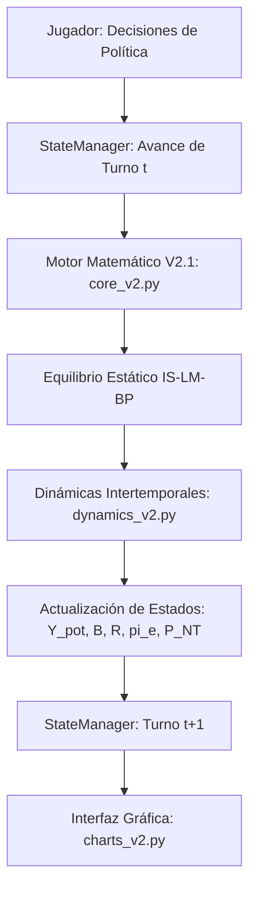

# Manual de Documentación Técnica y Macroeconómica
## Simulador Intertemporal "The Economic War Room" (Versión 2.1)

**Para:** Equipo de Ingeniería y Economía de Desarrollo  
**De:** Lead Technical Writer & Profesor de Macroeconomía Internacional  
**Fecha:** Mayo 2026  

---

## 1. Visión General del Proyecto

### 1.1. Propósito
El **Economic War Room** es un simulador macroeconómico intertemporal y estructural diseñado para modelar los desafíos de la formulación de políticas económicas en una economía abierta bajo diferentes regímenes cambiarios, shocks estructurales y vulnerabilidades fiscales. El simulador permite a estudiantes, investigadores y tomadores de decisiones actuar como ministros de economía o presidentes del banco central, enfrentando dilemas clásicos de política económica a lo largo de un horizonte de 10 turnos (períodos).



### 1.2. Integración de Modelos Teóricos
El simulador unifica dos de los pilares más importantes de la macroeconomía abierta en un motor dinámico consistente:

#### A. Corto Plazo: Modelo Mundell-Fleming Ampliado ($IS-LM-BP$)
Representa la determinación de la demanda agregada, las tasas de interés y el balance externo en el corto plazo. El modelo asume precios domésticos rígidos en cada período individual pero flexibles en la transición intertemporal.
* **Curva IS (Mercado de Bienes):** Modela la absorción doméstica y la balanza comercial. Incorpora aranceles a las importaciones ($\tau$), subsidios a las exportaciones ($s_x$), impuestos al consumo/ingreso ($t_c$) e impuestos corporativos ($t_k$).
  $$Y = C + I + G + NX$$
* **Curva LM (Mercado de Dinero):** Modela la oferta de saldos reales y la demanda de dinero por motivos de transacción y especulación.
  $$\frac{M}{P_{local}} = L(Y, r) = k \cdot Y - h \cdot r$$
* **Curva BP (Mercado de Divisas / Balanza de Pagos):** Incorpora la paridad descubierta de tasas de interés (UIP), la prima de riesgo país ($\rho$) y la imperfección en la movilidad de capitales ($f_{eff}$).
  $$r = r^* + \Delta E^e + \rho - \frac{NX}{f_{eff}}$$

#### B. Análisis Sectorial y Enfermedad Holandesa: Modelo Salter-Swan
El motor divide el producto total ($Y$) en dos sectores diferenciados basándose en el tipo de cambio real interno:
* **Sector Transable ($Y_T$):** Compuesto por bienes comerciables internacionalmente (commodities, manufacturas de exportación), cuya demanda es elástica y sus precios están anclados al mercado mundial.
* **Sector No Transable ($Y_{NT}$):** Compuesto por bienes de consumo local (servicios, construcción, comercio doméstico), cuyos precios se determinan puramente por las presiones de demanda interna.

El simulador computa la relación de precios relativos $q_{int} = \frac{P_T}{P_{NT}}$ para determinar el *share* sectorial del producto. Si la economía sufre de Enfermedad Holandesa (debido a shocks masivos de exportación o flujos financieros), ocurre una apreciación real ($q_{int} \downarrow$), lo que contrae el sector transable doméstico ($Y_T \downarrow$) en favor del sector no transable ($Y_{NT} \uparrow$).

### 1.3. Naturaleza Intertemporal del Simulador
La simulación no es una secuencia de equilibrios estáticos inconexos. El motor calcula las leyes de movimiento intertemporales donde los resultados del período $t$ modifican los stocks de activos, precios y expectativas para el período $t+1$:
1. **Acumulación de Deuda ($B_{t} \to B_{t+1}$):** El déficit fiscal total del período $t$ se financia emitiendo nuevos bonos soberanos.
2. **Consumo de Reservas ($R_{t} \to R_{t+1}$):** Las intervenciones del banco central y el saldo de la balanza de pagos modifican el stock de reservas internacionales.
3. **Anclaje de Expectativas adaptativas:** La inflación observada en $t$ se convierte en la inflación esperada para $t+1$ ($\pi^e_{t+1} = \pi_t$).
4. **Actualización de Precios Internos:** El precio del sector no transable ($P_{NT}$) crece según la inflación núcleo del período anterior.
5. **PIB Potencial dinámico:** La capacidad de oferta de largo plazo ($Y_{pot}$) crece de forma exógena pero es estimulada endógenamente por la inversión pública ($I_g$).

---

## 2. Arquitectura Técnica (El Motor de Python)

El software sigue una arquitectura desacoplada de tres capas con flujo de información unidireccional estricto, facilitando el mantenimiento y las pruebas automatizadas.

```
[ Capa de Presentación (UI) ] ── (Streamlit / Plotly )
           │
           ▼
[ Orquestador de Estado ] ───── ( SimStateManagerV2 / GameState )
           │
           ▼
[ Motor Matemático Puro ] ────── ( core_v2.py / dynamics_v2.py )
```

### 2.1. Capa de Presentación (UI / Dashboard)
El archivo principal `ui/dashboard_main.py` y el generador de visualizaciones `ui/charts_v2.py` representan esta capa. 
* **Principios de Aislamiento:** La interfaz es puramente lectora y reactiva; se limita a renderizar el diccionario `GameState` del orquestador. Las llamadas a los solvers están prohibidas en la UI.
* **Gráficos Plotly Avanzados:** La UI renderiza gráficos interactivos de alta gama, como el triángulo del Trilema de Mundell-Fleming mediante coordenadas ternarias y el Reloj del Ciclo Económico que mapea el desempleo invertido contra la inflación.

### 2.2. Orquestador de Estado (`SimStateManagerV2`)
Ubicado en `engine/state_manager_v2.py`, actúa como la única entidad autorizada para modificar el estado del juego. Ejecuta una **secuencia inalterable de 13 pasos** en su método `step_forward`:

1. **Validar Estado:** Verifica la integridad y el estatus actual de la simulación.
2. **Aplicar Políticas:** Actualiza los instrumentos elegidos por el jugador y detecta transiciones de régimen.
3. **Resolver PIB Potencial:** Ejecuta el crecimiento potencial incorporando los efectos de la inversión pública del turno.
4. **Resolver Equilibrio Estático:** Invoca al motor core para resolver el sistema $IS-LM-BP$.
5. **Computar Variables Derivadas:** Calcula la inflación del período, el desempleo y la composición sectorial.
6. **Ejecutar Finanzas Públicas:** Calcula la recaudación impositiva desagregada y actualiza la deuda.
7. **Verificar Circuit Breaker Cambiario:** Evalúa si las reservas cayeron por debajo de cero bajo tipo de cambio fijo.
8. **Calcular Salter-Swan:** Deriva las pendientes y clasifica la posición de equilibrio del país.
9. **Procesar Eventos y Shocks:** Evalúa desencadenantes probabilísticos y aplica shocks exógenos.
10. **Calcular Puntuación (Score):** Evalúa el bienestar social del período basado en brecha de PIB, inflación, desempleo y sostenibilidad fiscal.
11. **Guardar Snapshot:** Almacena los resultados del turno en el vector `history`.
12. **Actualizar Stocks Intertemporales:** Avanza el turno ($t \leftarrow t+1$) y traslada las variables de stock.
13. **Verificar Condiciones de Game Over:** Evalúa si la economía ha entrado en crisis de hiperinflación, default o depresión insostenible.

### 2.3. Resolviendo el Equilibrio Circular No Lineal
En un régimen de tipo de cambio fijo, el modelo es lineal en sus variables endógenas y se resuelve trivialmente mediante álgebra matricial clásica. Sin embargo, bajo **Tipo de Cambio Flexible o Flotación Sucia**, el sistema de ecuaciones presenta una dependencia circular altamente no lineal:

$$\begin{aligned}
E &\implies P_{local} \implies M_{real} \\
M_{real} &\implies (Y, r) \implies NX \implies E
\end{aligned}$$

Para resolver esta circularidad sin incurrir en divergencias extremas, el motor implementa un solver numérico avanzado en `eq_flexible_v2`:

1. **Optimización con `scipy.optimize.least_squares`:** El motor define el sistema de ecuaciones como un vector de residuos tridimensional $[eq_{IS}, eq_{LM}, eq_{BP}]$.
2. **Cotas Físicas y Económicas (Bounds):** Se imponen límites estrictos para evitar soluciones matemáticamente posibles pero económicamente absurdas (ej. PIB negativo o tasa de interés bajo cero):
   * $Y \in [10.0, 300.0]$
   * $r \in [0.1, 100.0]$
   * $E \in [0.1, 100.0]$
3. **Mecanismo de Fallback Jerárquico:** Si el resolvedor acotado de mínimos cuadrados no converge debido a un shock extremadamente severo, el motor intercepta la excepción e invoca a `scipy.optimize.fsolve` clásica con truncamiento defensivo posterior. Si este falla, se asume un retroceso conservador al estado del período anterior.

---

## 3. Diccionario de Variables y Políticas

Esta sección detalla los componentes esenciales que definen la estructura macroeconómica y el comportamiento del simulador.

### 3.1. Instrumentos de Política (Inputs del Jugador)
Estas son las variables de control directo del gobierno y del banco central. Se definen en `PolicyInstruments`:

| Variable | Símbolo | Tipo de Dato | Ecuación / Relación de Impacto | Descripción Macroeconómica |
| :--- | :---: | :---: | :--- | :--- |
| **Gasto Corriente** | $G_c$ | `float` | Componente de $G_{total}$ | Financia la administración pública y compras del gobierno. Afecta la demanda agregada directamente. |
| **Inversión Pública** | $I_g$ | `float` | $Y_{pot} = f(I_g)$ | Gasto de capital en infraestructura. Aumenta la demanda hoy y el PIB potencial mañana. |
| **Transferencias** | $Tr$ | `float` | $C = f(Y_d + Tr)$ | Gasto en transferencias a hogares. Estimula el consumo privado de forma indirecta según la PMgC ($c_1$). |
| **Impuesto al Consumo** | $t_c$ | `float` | $k_m = \frac{1}{1 - c_1(1-t_c) + m_{eff}}$ | Tasa proporcional al ingreso e ingreso disponible. Modifica el multiplicador keynesiano. |
| **Impuesto Corporativo** | $t_k$ | `float` | $I = I_0 - b \cdot r - \rho_k \cdot t_k$ | Tasa sobre ganancias empresariales. Desincentiva la inversión privada según la sensibilidad $\rho_k$. |
| **Arancel Comercial** | $\tau$ | `float` | $m_{eff} = m_1(1-\tau)$ | Gravamen a bienes importados. Reduce la propensión a importar y aumenta la recaudación fiscal. |
| **Subsidio a la Exportación**| $s_x$ | `float` | $X = X_{auto} + \epsilon_x \cdot q(1 + s_x)$ | Incentivo financiero a exportadores. Mejora la balanza comercial desplazando la curva IS. |
| **Controles de Capital** | $k_c$ | `float` | $f_{eff} = f(1 - k_c)$ | Barreras regulatorias a flujos financieros. Disminuye $f_{eff}$, volviendo la curva BP más empinada. |
| **Oferta Monetaria** | $M$ | `float` | $M_{real} = M/P_{local}$ | Dinero nominal circulante. Instrumento de política bajo régimen flexible. |
| **Tipo de Cambio Nominal** | $E$ | `float` | $q = \frac{E \cdot P^*}{P_{local}}$ | Precio de la divisa. Instrumento de política bajo régimen de tipo de cambio fijo. |

---

### 3.2. Variables Endógenas (Outputs del Modelo)
Estas variables se determinan simultáneamente dentro del sistema de equilibrio del motor matemático:

| Variable | Símbolo | Tipo de Dato | Ecuación de Determinación | Significado y Efecto Macroeconómico |
| :--- | :---: | :---: | :--- | :--- |
| **PIB de Equilibrio** | $Y$ | `float` | $Y = k_m \cdot (A_{dom} + NX)$ | Ingreso agregado y nivel de actividad real. |
| **Tasa de Interés** | $r$ | `float` | $r = \frac{k \cdot Y - M_{real}}{h}$ | Costo del dinero doméstico determinado en el mercado monetario y externo. |
| **Tipo de Cambio Real** | $q$ | `float` | $q = \frac{E \cdot P^*}{P_{local}}$ | Indicador de competitividad externa de precios. |
| **Balanza Comercial** | $NX$ | `float` | $NX = X(q, s_x) - M(Y, q, \tau)$ | Cuenta corriente simplificada. Balance entre exportaciones e importaciones. |
| **Nivel de Precios** | $P_{local}$ | `float` | $P_{local} = \alpha_{PT} P_T + (1-\alpha_{PT}) P_{NT}$ | Índice de Precios al Consumidor (IPC), ponderado por el sector transable y no transable. |
| **Tasa de Inflación** | $\pi$ | `float` | $\pi = \pi^e + \alpha_{inf} \cdot gap + \beta_{PT} \frac{\Delta E}{E_{t-1}}$ | Inflación general influenciada por demanda (gap) y devaluación (pass-through). |
| **Desempleo** | $U$ | `float` | $U = U_n - \gamma_{okun} \cdot gap$ | Tasa de desempleo del mercado de trabajo. |

---

### 3.3. Parámetros Estructurales (Fijos en Calibración)
Estos parámetros definen los rasgos de comportamiento psicológico e institucional de la economía simulada:

| Parámetro | Símbolo | Tipo | Valor Base | Descripción Teórica y Rol en el Modelo |
| :--- | :---: | :---: | :---: | :--- |
| **PMgC** | $c_1$ | `float` | $0.75$ | Propensión Marginal a Consumir. Determina la respuesta del consumo al ingreso neto ($Yd$). |
| **PMgM** | $m_1$ | `float` | $0.15$ | Propensión Marginal a Importar. Controla la fuga de demanda interna hacia el sector externo. |
| **Sensibilidad Inversión**| $b$ | `float` | $2.0$ | Elasticidad de la inversión a la tasa de interés. Controla el impacto del crowding-out. |
| **Elasticidad Dinero-Y** | $k$ | `float` | $0.50$ | Sensibilidad de la demanda transaccional de dinero al ingreso agregado. |
| **Elasticidad Dinero-r** | $h$ | `float` | $2.00$ | Demanda especulativa de dinero. Si $h$ es muy bajo, la LM es empinada (monetarista). |
| **Movilidad de Capitales**| $f$ | `float` | $5.0$ | Facilidad de arbitraje. Si $f \to \infty$, la curva BP tiende a ser horizontal (UIP pura). |
| **Pass-through** | $\beta_{PT}$ | `float` | $0.20$ | Porcentaje de la devaluación nominal que se transmite directamente a la inflación. |

---

## 4. Dinámicas Intertemporales y Casos Límite

### 4.1. La Bola de Nieve de la Deuda
La dinámica de sostenibilidad fiscal opera bajo una fuerte estructura de retroalimentación intertemporal no lineal, la cual simula el ciclo de sobreendeudamiento soberano:

```
                  ┌── Defecto Fiscal t ──► Deuda Soberana B
                  │                           │
                  ▲                           ▼
             Intereses t ◄── Sovereign Rate ◄─┘
```

1. **Determinación del Balance Fiscal:** Cada período, el gobierno recauda impuestos y aranceles, y ejecuta el gasto primario:
   $$T_t = t_c \cdot Y_t + t_k \cdot Y_t + \tau \cdot M_{imp, t}$$
   $$G_{primario, t} = G_{c, t} + I_{g, t} + Tr_t$$
2. **Servicio de la Deuda:** El costo del interés de la deuda acumulada del período anterior depende de la tasa internacional más la prima de riesgo país:
   $$Intereses_t = (r^* + \rho_t) \cdot B_{t-1}$$
   $$Deficit_{total, t} = G_{primario, t} + Intereses_t - T_t$$
3. **La Prima de Riesgo Soberano ($\rho$):** Se determina de forma discreta de acuerdo a la razón Deuda/PIB:
   $$\text{debt\_ratio} = \frac{B_{t-1}}{Y_{pot, t}}$$
   * $\text{debt\_ratio} < 30\% \implies \rho = 0.01$ (Rating A)
   * $\text{debt\_ratio} < 60\% \implies \rho = 0.03$ (Rating BBB)
   * $\text{debt\_ratio} < 90\% \implies \rho = 0.06$ (Rating BB-)
   * $\text{debt\_ratio} < 120\% \implies \rho = 0.12$ (Rating CCC)
   * $\text{debt\_ratio} \ge 120\% \implies \rho = 0.25$ (Rating DEFAULT)
   * *Ajuste Especial:* Si las reservas internacionales son negativas ($R < 0$), se añaden automáticamente 500 puntos básicos ($+0.05$) a la prima por vulnerabilidad cambiaria.
4. **Acumulación de Deuda y Techo de Restructuración (Cap):**
   $$B_{t} = \max(-100.0, \min(3.0 \cdot Y_t, B_{t-1} + Deficit_{total, t}))$$
   *El cap en $3.0 \cdot Y_t$ (300% del PIB) simula una reestructuración de default soberano de emergencia, bloqueando el desbordamiento de punto flotante en la memoria de Python (`float64 overflow`).*

---

### 4.2. Flotación Sucia y Reservas
El simulador incorpora la flotación sucia (`dirty_float`), permitiendo modelar intervenciones esterilizadas y no esterilizadas del Banco Central en la banda cambiaria:

```mermaid
flowchart TD
    A[Resolver Equilibrio Flexible Puro] --> B{¿E_endo > E_band_upper?}
    B -- Sí --► C[Forzar Régimen Fixed con E = E_band_upper]
    C --> D[Calcular Oferta Monetaria Endógena M_endo]
    D --> E[Vender Reservas: R_new = R - Intervention]
    B -- No --► F[Mantener Flotación Flexible Libre]
```

1. **Defensa de la Banda Cambiaria:** Si el tipo de cambio endógeno calculado por el solver flexible supera el límite superior de la banda cambiaria programado por el jugador ($E_{endo} > E_{band\_upper}$):
   * El orquestador fuerza temporalmente un régimen de tipo de cambio fijo fijando $E = E_{band\_upper}$.
   * El motor re-resuelve el equilibrio macroeconómico completo bajo tipo de cambio fijo para hallar la demanda real de dinero consistente.
2. **Consumo de Reservas por Intervención:** La cantidad de divisas quemadas para defender la paridad es proporcional a la contracción monetaria necesaria para defender el tipo de cambio:
   $$Intervention\_Amount = \max\left(0, \frac{M_{original} - M_{endo}}{E_{band\_upper}}\right)$$
   $$R_t = R_{t-1} + NX_t + KA_t - Intervention\_Amount$$
   *(Garantizando la consistencia exacta de la Balanza de Pagos: $CA + KA + \Delta R = 0$).*

---

### 4.3. Conditions de Fin del Juego (Game Over)
El State Manager evalúa continuamente el bienestar del sistema, disparando la finalización prematura de la partida si se cruzan los siguientes umbrales de alerta crítica:

* **💀 Depresión Económica:** Si la brecha de PIB estructural es excesivamente recesiva por dos turnos consecutivos:
  $$gap_t < -15.0\% \implies \text{Game Over por Colapso de Demanda}$$
* **💀 Hiperinflación Descontrolada:** Si el desanclaje de expectativas de inflación y el pass-through superan el umbral tolerable:
  $$\pi_t > 30.0\% \implies \text{Game Over por Espiral de Precios}$$
* **💀 Insolvencia Soberana (Default):** Si la acumulación de la bola de nieve de la deuda supera la capacidad de pago del país:
  $$\text{debt\_ratio} = \frac{B_t}{Y_t} > 150\% \implies \text{Game Over por Default de Deuda Sólida}$$
* **💀 Crisis de Reservas Cambiaria:** Si el banco central agota por completo sus reservas internacionales líquidas bajo tipo de cambio fijo:
  $$R_t \le 0 \implies \text{Se dispara el Circuit Breaker de Crisis cambiaria}$$
  *El circuit breaker desactiva el régimen fijo, fuerza la flotación cambiaria libre y devalúa la moneda nominalmente un 20% de emergencia en un solo turno, provocando una espiral inflacionaria devastadora.*
